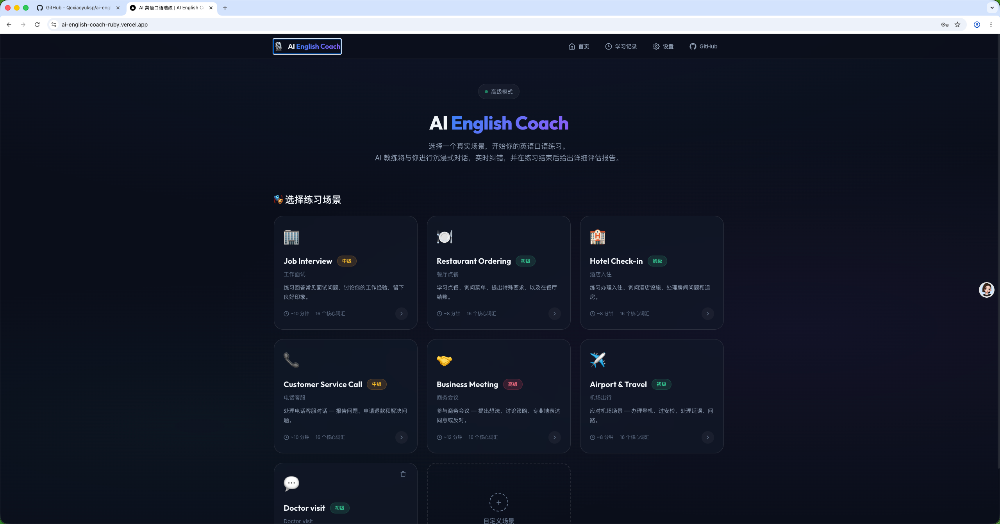
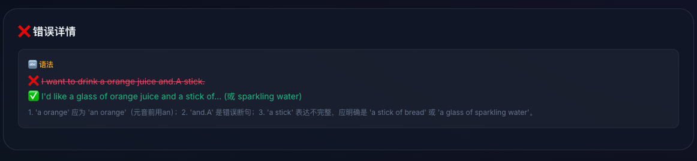
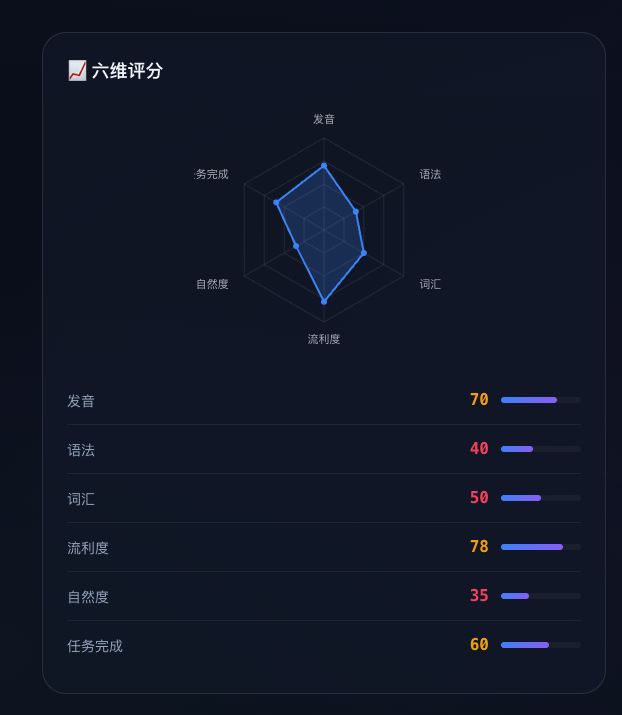

# AI 英语口语陪练 · AI English Speaking Coach

> 在真实场景下进行英语口语对话训练的纯前端 Web 应用：**选场景 → 实时语音对话 → 边聊边纠错 → 课后可量化报告 → 历史追踪**。
>
> 界面中文、对话全英文。不填任何 API Key 即可用浏览器语音零成本体验；填入自己的大模型 Key 可获得高质量真实对话。

🔗 **在线体验**：<https://ai-english-coach-ruby.vercel.app/>

🎬 **Demo 视频**：https://www.bilibili.com/video/BV1XQE869EBU/  （发现没录上系统声音啊！评委大大可以本地部署一下，是有声音的😢）

> 在线体验为纯前端部署（Vercel）。推荐使用 Chrome / Edge 桌面浏览器；语音功能需授权麦克风（HTTPS 下生效）。不填 Key 即可体验免费模式。

---

## ✨ 功能特色

- **🎬 场景化对话**：内置 6 大高频场景（工作面试、餐厅点餐、酒店入住、电话客服、商务会议、机场出行），每个场景有独立的 AI 角色人设、对话流程与核心词汇；支持自定义创建专属场景。
- **🎙️ 实时语音对话**：语音转文字（STT）与文字转语音（TTS）即点即说，AI 用英文语音回应。识别可选浏览器 Web Speech 或**云端 ASR（硅基流动 SenseVoice，录音整段识别、不被停顿截断，Edge/Firefox 也可用）**；发音可选浏览器合成或**云端 TTS（小米 MiMo，更自然）**。
- **⚖️ 双阶段纠错**：
  - 对话中——通过 LLM function calling 实时捕捉语法 / 表达 / 用词问题，以轻量气泡（FeedbackBubble）即时提示，不打断对话节奏；
  - 课后——生成深度报告，逐条列出错误、修正建议与例句。
- **📊 可解释的发音评测与六维报告**：课后报告含六维雷达图（发音、语法、词汇、流利度、自然度、任务完成度）。发音/流利度分数基于**真实信号**——语音识别置信度与语速（WPM）——算法透明、敢讲依据，而非模型臆造。
- **🔌 多 Provider + 三段可配置架构**：ASR / LLM / TTS 三段解耦，引擎随模式切换。LLM 支持 OpenAI、Google Gemini、DeepSeek、Groq、智谱 GLM、硅基流动、ModelScope、OpenRouter 及任意 OpenAI 兼容服务，按提供商分别记忆配置，支持一键获取模型列表与 Base URL 自动容错。标准/高级模式可二选一使用**服务端内置免费能力**（智谱 LLM、小米 TTS、硅基 ASR）或**自填自己的 API**；高级模式下自定义 ASR/TTS 还可一键「测试连接」验证可用性。
- **🆓 零成本可用**：不填 Key 即用浏览器内置语音 + 服务端内置对话 + 本地评测跑通全流程。
- **↩️ 断点续接**：练习中途离开页面，返回时自动恢复对话进度，不丢上下文。
- **🗂️ 历史记录与进步追踪**：**练习结束即自动生成报告**，无需手动打开；历史页用折线图展示**成绩随时间变化趋势**、聚合**高频纠错**（按语法/表达/词汇分类 + 最常出现的纠错条目），并可回看任意一次报告。
- **🎨 暗色科技风 UI**：玻璃态卡片 + 实时音频可视化 + 应用内统一确认弹框。

---

## 🖼️ 界面预览

> 截图 / GIF 占位，部署后补充。

| 首页 · 场景选择 | 语音对话 · 实时纠错 | 课后报告 · 六维雷达图 |
| :---- | :---: | :---: |
|  |  |  |

---

## 🧱 技术架构

纯前端单体应用，基于 **Next.js 15 App Router**。语音链路三段解耦（ASR 识别 / LLM 对话 / TTS 发音），引擎随模式切换，并通过服务端代理保护密钥：

```
   ASR（语音转文字）          LLM（对话生成）            TTS（文字转语音）
 ┌─────────────────┐     ┌──────────────────┐     ┌─────────────────┐
 │ Web Speech(浏览器)│    │  Provider 层      │     │ 浏览器 / 小米    │
 │  或 云端 ASR     │ →   │ 内置智谱 / 多家     │ →   │  MiMo 云端 TTS  │
 │ (硅基 SenseVoice)│     │ 自配 LLM          │     │                 │
 └─────────────────┘     └──────────────────┘     └─────────────────┘
                                  │
                 服务端代理（密钥仅在服务端，不暴露前端）
          /api/chat  /api/analyze  /api/asr  /api/tts  /api/models
```

**三种模式**

| 模式 | ASR 识别 | LLM 对话 | TTS 发音 | 用户需配置 |
| --- | --- | --- | --- | --- |
| 🟢 免费 | 浏览器 Web Speech | 内置智谱（服务端）/ 本地话术兜底 | 浏览器 SpeechSynthesis | 无（零配置） |
| 🟡 标准 | 浏览器 Web Speech | 内置智谱 **或** 自配 LLM | 内置小米 MiMo（免费，失败回退浏览器） | 可选配 LLM |
| 🔵 高级 | 内置硅基（默认）**或** 自填 ASR API | 内置智谱 **或** 自配 LLM | 内置小米（默认）**或** 自填 TTS API | 可选 |

> 内置 LLM（智谱）、TTS（小米 MiMo）、ASR（硅基流动）的密钥均通过**服务端环境变量**配置，绝不下发到浏览器。用户也可在设置中填入自己的各家 API（标准/高级模式），配置自动持久保存。

**目录结构**

```
frontend/
├── app/                    # Next.js App Router 页面与 API 路由
│   ├── page.tsx            # 首页（场景选择）
│   ├── practice/           # 语音对话页
│   ├── report/             # 课后报告页
│   ├── history/            # 历史记录页
│   ├── settings/           # API / Provider 配置页
│   └── api/                # 服务端代理：chat（对话+纠错）、analyze（报告）、
│       │                   #   asr（云端识别）、tts（云端合成）、models（模型列表）
│       └── ...
├── components/             # UI 组件（VoiceChat、FeedbackBubble、RadarChart、ProgressTrend 等）
├── hooks/                  # useVoiceSession（会话状态机）、useWebSpeech、useIsClient 等
├── lib/
│   ├── ai-providers/       # Provider 抽象层（OpenAI 兼容 + Gemini）
│   ├── speech/             # 语音封装：Web Speech STT/TTS、云端 TTS（api-tts）、录音器（recorder）
│   ├── config.ts           # 配置单一真相源（模式/引擎派生、迁移）+ 单测
│   ├── analyzer.ts         # 可解释发音/流利度评测（纯函数）+ 单测
│   ├── free-coach.ts       # 免费模式本地兜底话术（纯函数）+ 单测
│   ├── scenarios.ts        # 内置场景定义
│   ├── prompts.ts          # 系统提示词 + 回复净化（纯函数）+ 单测
│   └── storage.ts          # localStorage 持久化封装
└── types/                  # TypeScript 类型 + Web Speech 类型声明
```

> 核心纯函数（`config` / `analyzer` / `free-coach` / `prompts`）配有 **Vitest 单元测试**（`*.test.ts`），运行 `npm test` 验证。

**数据持久化**：使用浏览器 `localStorage`（封装于 `lib/storage.ts`，接口已解耦，可后续替换为 IndexedDB / 后端）。无服务器数据库，用户数据仅保存在本地浏览器。

**发音评测算法**（`lib/analyzer.ts`，纯确定性函数）：
- 发音可懂度 ← 语音识别置信度映射到 0–100；
- 流利度 ← 语速（WPM）落在自然会话区间时得分最高；
- 词汇 ← 词型/词例比（TTR）衡量多样性；
- 语法 ← 纠错密度；
- 综合分按加权汇总（发音 0.2 / 语法 0.2 / 流利度 0.2 / 词汇 0.15 / 任务完成度 0.15 / 自然度 0.1）。

---

## 🚀 快速开始

环境要求：Node.js ≥ 18，推荐使用 **Chrome / Edge** 浏览器（Web Speech API 兼容性最佳）。

```bash
cd frontend
npm install
npm run dev
```

打开 [http://localhost:3000](http://localhost:3000) 即可使用。

> 不填任何 Key 也能直接体验「免费模式」全流程。需要更高质量的对话时，进入 **设置页** 填入大模型 API Key。

其他命令：

```bash
npm run build   # 生产构建（含类型检查与 ESLint，lint 报错会导致构建失败）
npm run start   # 运行生产构建
npm run lint    # 单独执行 ESLint
npm test        # 运行 Vitest 单元测试（纯函数）
```

---

## 🔧 支持的 AI 提供商与配置

在应用内 **设置页** 选择提供商、填入 API Key 与模型名即可（也可点测试连接验证）。配置仅保存在浏览器本地，并按提供商分别记忆。

| 提供商 | 默认 Base URL | 示例模型 | 说明 |
| --- | --- | --- | --- |
| **Google Gemini** | `https://generativelanguage.googleapis.com/v1beta` | `gemini-2.0-flash` | **有免费额度，推荐初次使用** |
| **DeepSeek** | `https://api.deepseek.com/v1` | `deepseek-chat` | 高性价比，中文能力强（演示默认） |
| **Groq** | `https://api.groq.com/openai/v1` | `llama-3.3-70b-versatile` | 极速推理，有免费额度 |
| **智谱 GLM** | `https://open.bigmodel.cn/api/paas/v4` | `glm-4-flash` | `glm-4-flash` 免费，中文能力强 |
| **硅基流动 SiliconFlow** | `https://api.siliconflow.cn/v1` | `Qwen/Qwen2.5-7B-Instruct` | 聚合多家开源模型，有免费额度 |
| **ModelScope 魔搭** | `https://api-inference.modelscope.cn/v1` | `Qwen/Qwen2.5-7B-Instruct` | 魔搭社区免费推理 API |
| **OpenRouter** | `https://openrouter.ai/api/v1` | `openai/gpt-4o-mini` | 一个 Key 聚合众多模型 |
| **OpenAI** | `https://api.openai.com/v1` | `gpt-4o-mini` | 支持 GPT-4o |
| **自定义（OpenAI 兼容）** | 自填 | 自填 | 支持任意 OpenAI 兼容 API |

> **更省心的配置体验**：
> - **Base URL 容错**——无论填 `.../v1`、`.../v1/`、`.../v1/chat`，还是整段 `.../v1/chat/completions`，都会被自动归一化，不会因结尾写法不同而报错。
> - **一键获取模型列表**——填好 Key 后点「获取模型列表」，由服务端代理拉取该提供商的可用模型并下拉选择（也可手动填写）。

> **想免费体验真实对话？** 推荐到 [Google AI Studio](https://aistudio.google.com/) 免费申请 Gemini API Key，在设置页选择 Google Gemini 填入即可。

**关于 API Key 安全**：所有对第三方服务的请求都经由本应用的服务端代理（`/api/chat`、`/api/analyze`、`/api/asr`、`/api/tts`、`/api/models`）转发。内置能力（智谱 LLM、小米 TTS、硅基 ASR）的密钥仅通过**服务端环境变量**配置，绝不下发浏览器；用户自配的 Key 保存在本地浏览器（localStorage）并随请求经服务端代理转发，不写入仓库、不上传第三方。

---

## 📦 依赖说明（赛事有效性声明）

本项目**刻意保持极简依赖**，运行时仅依赖 React 与 Next.js，未引入任何第三方 UI 组件库、图表库或语音 SDK。

**运行时依赖（`frontend/package.json`）**

| 依赖 | 版本 | 用途 |
| --- | --- | --- |
| `next` | ^15.5.19 | React 全栈框架（App Router、API 路由、构建） |
| `react` | 19.2.4 | UI 框架 |
| `react-dom` | 19.2.4 | React DOM 渲染 |

**开发依赖**：`typescript`、`@types/*`、`eslint`、`eslint-config-next`（类型检查与代码规范）、`vitest`（纯函数单元测试）。

**浏览器原生能力（非 npm 依赖）**：
- [Web Speech API](https://developer.mozilla.org/en-US/docs/Web/API/Web_Speech_API)（`SpeechRecognition` / `SpeechSynthesis`）——语音识别与合成；
- Web Audio API —— 音频可视化。

### 原创部分声明

以下功能均为本项目**自主设计与实现**，未复用第三方代码：

- **可解释发音/流利度评测算法**（`lib/analyzer.ts`）：基于识别置信度与语速的透明评分模型；
- **六维雷达图**（`components/RadarChart.tsx`）与**成绩趋势折线图**（`components/ProgressTrend.tsx`）：零依赖、手写 SVG 绘制；
- **语音会话状态机**（`hooks/useVoiceSession.ts`）：录音/对话/纠错/计时/草稿续接、浏览器与云端 ASR 分流的统一编排；
- **三段引擎与模式派生**（`lib/config.ts`）：按 voiceMode 推导 ASR/LLM/TTS 引擎、旧配置迁移；
- **小米 MiMo TTS 适配器**（`app/api/tts` + `lib/speech/api-tts.ts`）与**硅基流动 ASR 代理**（`app/api/asr` + `lib/speech/recorder.ts`，含 MediaRecorder 整段录音）；
- **双阶段纠错机制**：对话中 function calling 轻提示 + 课后深度报告，并对模型误内联的纠错文本做净化（`sanitizeSpokenReply`）；
- **练习结束自动生成报告**与历史趋势/高频纠错聚合；
- **多 Provider 抽象层**（`lib/ai-providers/`）：一套代码适配 OpenAI 兼容与 Gemini 两类协议；
- **场景系统、设置/配置记忆、localStorage 持久化层、整体 UI 与交互设计**。

> 项目脚手架由 `create-next-app` 生成；除上述列明的框架/工具外，不依赖其他第三方库。

---

## 📄 开源协议

本项目采用 [MIT License](./LICENSE)。
